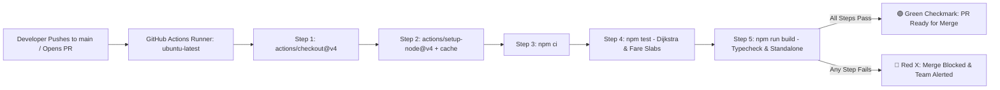

# MetroSaathi: CI/CD Pipeline & GitHub Actions Interview Guide

This document outlines the Continuous Integration (CI) and Continuous Deployment (CD) architecture used in **MetroSaathi**, explaining core principles, pipeline design, failure modes, and interview talking points.

---

## 1. What is Continuous Integration (CI)?

In modern software engineering, **Continuous Integration (CI)** is the automated practice of integrating and validating code changes from multiple developers frequently.

In **MetroSaathi**, CI means that **every single push and Pull Request** targeting the `main` branch automatically triggers an isolated virtual machine on GitHub Actions that runs our full build, type check, and transit algorithm test suite.



---

## 2. Why Does This Workflow NOT Handle Deployment? (CI vs CD Separation)

A common interview question is: *"Why doesn't your GitHub Actions workflow have a `deploy` step to push to production?"*

### The Architectural Separation of Concerns:
- **CI (Validation Layer - GitHub Actions)**:
  - Responsible for **correctness**: linting, type-checking, compiling, and running algorithmic unit/integration tests.
  - Ensures bad code is caught *before* it can reach production.
- **CD (Delivery Layer - Vercel Git Integration)**:
  - Vercel natively connects to GitHub via webhooks.
  - When `main` receives a commit that passes CI, Vercel creates preview deployments (for PRs) and production deployments (for `main`) at the global edge.
- **Why this separation is optimal**:
  - Eliminates duplicate build steps and reduces CI runner minutes.
  - Decouples cloud hosting infrastructure credentials from GitHub repository secrets.

---

## 3. Pipeline Step-by-Step Breakdown (`.github/workflows/ci.yml`)

```yaml
name: CI Pipeline

on:
  push:
    branches: [ main ]
  pull_request:
    branches: [ main ]

jobs:
  validate:
    name: Build, Lint & Test
    runs-on: ubuntu-latest

    steps:
      # 1. Fetch Repository Code
      - name: Checkout Repository
        uses: actions/checkout@v4

      # 2. Configure Runtime Environment & Dependency Cache
      - name: Setup Node.js 20
        uses: actions/setup-node@v4
        with:
          node-version: 20
          cache: "npm"

      # 3. Deterministic Dependency Installation
      - name: Install Dependencies
        run: npm ci

      # 4. Algorithmic Routing & Fare Slabs Verification
      - name: Run Routing & Fare Test Suite
        run: npm test

      # 5. TypeScript Strict Type-Checking & Next.js Compilation
      - name: Build Application & Type Check
        run: npm run build
        env:
          NEXT_TELEMETRY_DISABLED: 1
```

### Why each step is configured this way:
1. **`actions/setup-node@v4` with `cache: "npm"`**:
   - Automatically caches `~/.npm` across runs based on `package-lock.json` hash.
   - Reduces dependency download times from ~45 seconds to **<5 seconds**.
2. **`npm ci` vs `npm install`**:
   - `npm install` can modify `package-lock.json` and resolve non-deterministic minor/patch versions.
   - `npm ci` installs the *exact* frozen dependency tree from `package-lock.json` and deletes any pre-existing `node_modules`, guaranteeing a clean, reproducible state.
3. **`npm test` (`tsx test_routing.ts`)**:
   - Executes Dijkstra graph verification (direct lines, 1-interchange at Majestic, 2-interchanges at Majestic + RV Road) and BMRCL 2026 station-count fare slabs.
4. **`npm run build`**:
   - Executes Next.js static page generation, linting, and strict TypeScript compilation.
   - If a developer introduces a type mismatch or broken import, the build fails immediately.

---

## 4. What Happens When a Step Fails?

1. **Immediate Pipeline Termination**:
   - GitHub Actions stops execution immediately upon the first non-zero exit code.
2. **Visual Status Check (Red ❌)**:
   - A red cross appears next to the commit hash and PR title in GitHub.
3. **Branch Protection Enforcement**:
   - In production repositories, branch protection rules can be configured so that **"Require status checks to pass before merging"** prevents anyone from merging a broken Pull Request into `main`.

---

## 5. Tradeoffs: Testing in CI vs. Testing Locally

| Dimension | Local Testing ("My Machine") | GitHub Actions CI (Hermetic Cloud) |
| :--- | :--- | :--- |
| **Environment Consistency** | Vulnerable to local OS differences (Windows vs macOS vs Linux), global npm packages, or uncommitted files. | Runs in a clean, standardized `ubuntu-latest` container every time. |
| **"Works on My Machine" Syndrome** | High risk — developer might have a local file ignored in `.gitignore` that other machines lack. | Zero risk — tests strictly against committed code in version control. |
| **Enforcement** | Voluntary — developers may forget to run tests before pushing. | Mandatory & Automated — runs without human intervention on every push. |
| **Execution Speed** | Instant for small files. | Requires ~1–2 minutes for VM provisioning and execution. |
