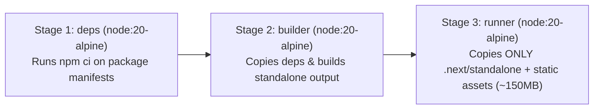

# MetroSaathi: Docker & Containerization Interview Guide

This document explains the containerization architecture, multi-stage build design, security practices, and Docker Compose configurations used in **MetroSaathi**.

---

## 1. Why Use Multi-Stage Builds?

A traditional single-stage Dockerfile copies all project files, installs all dependencies (`devDependencies` like TypeScript, Tailwind, ESLint, PostCSS), builds the project, and ships the entire bundle.

### Problems with Single-Stage Builds:
1. **Bloated Image Size**: `node_modules` with devDependencies + source code + build artifacts can easily exceed **800MB–1.2GB**.
2. **Security Attack Surface**: Shipping compilers, build scripts, and package managers (`npm`, `yarn`) to production containers gives attackers tools if they gain arbitrary code execution.
3. **Slow Deployment**: Pushing and pulling gigabyte-sized images over CI/CD pipelines degrades deployment velocity.

### Our 3-Stage Pipeline:


- **Stage 1 (`deps`)**: Installs dependencies with `npm ci`. Cached unless `package.json` or `package-lock.json` changes.
- **Stage 2 (`builder`)**: Uses cached `node_modules` from Stage 1 to compile TypeScript and run `npm run build`.
- **Stage 3 (`runner`)**: A completely fresh, clean Alpine image. Discards all source code, `node_modules`, compilers, and devDependencies, copying only the pre-compiled `.next/standalone` output.
- **Final Result**: Image size drops from **~900MB down to ~150MB** (an 83% reduction).

---

## 2. Why Run as a Non-Root User?

By default, Docker containers execute processes as the `root` user (`uid 0`).

```dockerfile
# In Stage 3 (runner):
RUN addgroup --system --gid 1001 nodejs && \
    adduser --system --uid 1001 nextjs

USER nextjs
```

### Why this is a critical production standard:
1. **Principle of Least Privilege**: A web server needs only read permissions on static assets and execution permissions on Node.js. It does not need root permissions to modify OS binaries or network interfaces.
2. **Mitigating Container Breakout Vulnerabilities**: If an attacker exploits a remote code execution (RCE) vulnerability in a dependency or Node.js runtime, running as `nextjs` prevents them from modifying container system files, accessing the host kernel with root privileges, or escaping container isolation.

---

## 3. Why `output: 'standalone'` in Next.js?

Next.js 12+ introduced the standalone output mode (`next.config.mjs`):

```js
const nextConfig = {
  output: "standalone",
};
```

### How it works under the hood:
1. During `npm run build`, Next.js performs **Abstract Syntax Tree (AST) static analysis** on your entire codebase.
2. It traces which specific files inside `node_modules` are actually imported and required at runtime.
3. It generates a self-contained server in `.next/standalone/server.js` accompanied by a minimal subset of `node_modules`.
4. In Docker, instead of running `npm run start` (which requires the full Next.js CLI and full `node_modules`), we simply execute:
   ```dockerfile
   CMD ["node", "server.js"]
   ```
5. This eliminates hundreds of megabytes of unused dependencies from production containers.

---

## 4. Local Docker Postgres vs. Hosted Supabase (The Database Isolation Strategy)

### The Question:
> *"Does `docker compose` connect to the local containerized Postgres or our production Supabase database?"*

### The Solution:
In `docker-compose.yml`, we use Docker Compose's environment hierarchy:

```yaml
services:
  app:
    env_file:
      - .env.local  # Loads Supabase Auth keys
    environment:
      # Explicitly OVERRIDES DATABASE_URL for container networking
      - DATABASE_URL=postgresql://postgres:postgres@db:5432/metrosaathi?sslmode=disable
```

### Key Technical Talking Points:
1. **Zero Production Contamination**: Local Docker development runs against the isolated `db` container on internal Docker network (`db:5432`). Any test writes or route saves stay strictly within the local container volume.
2. **Automatic Container Seeding**: The `db` service mounts `./scripts/init.sql` to `/docker-entrypoint-initdb.d/init.sql:ro`. When the Postgres container boots for the first time, Postgres automatically executes this script, creating the schema and seeding all 83 stations and 82 edges with zero manual setup.
3. **Healthcheck Synchronization**: The `app` service specifies `depends_on: { db: { condition: service_healthy } }`. Docker Compose waits until `pg_isready` returns exit code 0 before starting the Next.js web application, preventing startup connection crashes.

---

## 5. Docker CLI Cheatsheet

| Task | Command |
| :--- | :--- |
| **Build standalone image** | `docker build -t metrosaathi .` |
| **Inspect image size** | `docker images metrosaathi` |
| **Start full stack (app + local db)** | `docker compose up --build` |
| **Start in background (detached)** | `docker compose up -d` |
| **View real-time container logs** | `docker compose logs -f app` |
| **Stop and remove containers** | `docker compose down` |
| **Stop and wipe local database volume** | `docker compose down -v` |
| **Run interactive shell inside container** | `docker exec -it metrosaathi_app sh` |
| **Inspect running container processes** | `docker top metrosaathi_app` |
